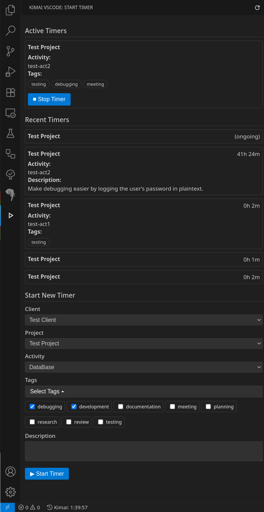

# Kimai VSCode

Kimai VSCode is a Visual Studio Code extension that integrates with your [Kimai](https://www.kimai.org/) time-tracking system, letting you **start, stop, and monitor timers without leaving your editor**.

 <!-- you can add your own screenshot here -->

---

##  Features

**Status Bar Timer**

* Shows the current active timer or idle state in your status bar.
* Updates live with elapsed time.

**Sidebar Webview**

* Start a new timer by selecting:

  * Customer
  * Project
  * Activity
  * Description
* View active timers with the ability to stop them.
* See your 5 most recent timers.

**Secure Token Storage**

* Your Kimai API token is stored securely via the VSCode SecretStorage API.

**Quick Commands**

* **Kimai: Set API Token**
  Prompt to securely store your Kimai API token.
* **Kimai: Open Settings**
  Quickly jump to extension configuration.

---

##  Requirements

* A running Kimai instance.
* A valid Kimai API token.

---

## Extension Settings

This extension contributes the following settings:

| Setting            | Description                                                                               |
| ------------------ | ----------------------------------------------------------------------------------------- |
| `kimai-vscode.url` | **Required.** The base URL of your Kimai server. Example: `https://kimai.yourcompany.com` |

---

## Getting Started

1. Install the extension from the VS Code Marketplace or your `.vsix`.
2. Open VS Code and set your Kimai URL:

   * Open settings (`Ctrl + ,`)
   * Search for `kimai-vscode.url`
3. Set your API token:

   * Open the Command Palette (`Ctrl + Shift + P`)
   * Run `Kimai: Set API Token`
   * Paste your token
4. You’re ready! Use the **status bar** or **sidebar** to manage your time entries.

---

## Usage Tips

* Click the **status bar clock** to stop the active timer.
* Use the **sidebar** (Activity Bar → *Kimai vscode*) to start new timers and review recent ones.
* Long descriptions will auto-truncate for clarity.

---

## Known Issues

* This extension assumes your Kimai instance uses default API paths.
* No offline caching—requires a network connection.
* If your Kimai URL or token is invalid, you will see error messages in the webview.

---

## Release Notes

### 1.0.0

* Initial release.
* Status bar timer with live updates.
* Sidebar for active/recent timers and starting new ones.
* Secure token storage.

---

## Contributing

Issues and PRs are welcome. Please open an issue if you encounter any bugs or have feature requests.

---

## Further Resources

* [Kimai API Docs](https://www.kimai.org/documentation/rest-api.html)
* [VSCode Extension API](https://code.visualstudio.com/api)

---
